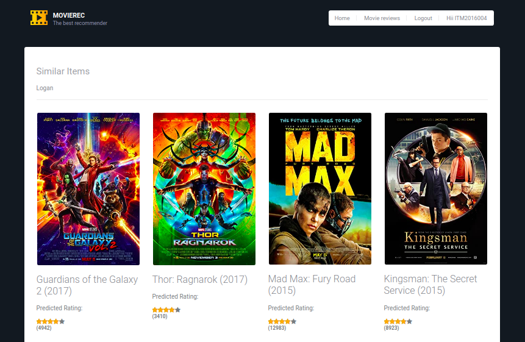

# MovieRec
This project is a web app for movie websites like Netflix where a user is allowed to create an account and watch movies. This web app has mainly focused on the quality of recommendations we make to the user. From the various forms of recommendations we have used some of the most appropriate ones. The user can view the already watched and rated movies in the dashboard. But before that when the user opens the web app he is prompted to login the website if not registered we can as well register. The web app has a nice GUI with every button and field labeled with their respective role. So, the user will not face any difficulty in using the web app.

## Welcome to MovieRec
 

## Login and Register Module 
This module is what I will see first after opening the web app. Here the user is asked to enter the username and password to be able to login and see the dashboard. If not registered, users can go to the registration page. Where it can fill the details and get registered after which certain questions will be asked for solving the “cold start” problem.

 

## Watch List Module
This module basically deals with already registered users where we display the rated movies by the user where users can change the ratings as well.

 

## Top K Recommended List Module
Then there is a top K recommended list module which shows the user recommended list of movies based on the user-based collaborative filtering method.

 

## Movie Details and Similar Movies Module
This module is responsible for showing any particular movie details with the predicted ratings. Then there is a separate section showing the similar movies based on the attributes and tags using item-item collaborative filtering. This module inherently gets called whenever the user clicks on the movie to see the details.

 
 

# Tutorial Guide
## A scalable on-line movie recommender using Spark and Flask  
This Apache Spark tutorial will guide you step-by-step into how to use the [MovieLens dataset](http://grouplens.org/datasets/movielens/) to build a movie recommender using [collaborative filtering](https://en.wikipedia.org/wiki/Recommender_system#Collaborative_filtering) with [Spark's Alternating Least Saqures](https://spark.apache.org/docs/latest/mllib-collaborative-filtering.html) implementation. It is organised in two parts. The first one is about getting and parsing movies and ratings data into Spark RDDs. The second is about building and using the recommender and persisting it for later use in our on-line recommender system.    

This tutorial can be used independently to build a movie recommender model based on the MovieLens dataset. Most of the code in the first part, about how to use ALS with the public MovieLens dataset, comes from my solution to one of the exercises proposed in the [CS100.1x Introduction to Big Data with Apache Spark by Anthony D. Joseph on edX](https://www.edx.org/course/introduction-big-data-apache-spark-uc-berkeleyx-cs100-1x). Starting from there, I've added different techniques with modifications to use a larger dataset, then code about how to store and reload the model for later use, and finally a web service using Flask. 

In any case, the use of this algorithm with this dataset is not new (you can [Google about it](https://www.google.com/search?ei=tJSAX5WYC6Se4-EPlc6z-AU&q=movielens+dataset+recommender+system&oq=movielens+dataset+recommender+system&gs_lcp=CgZwc3ktYWIQAzIECAAQRzIECAAQRzIECAAQRzIECAAQRzIECAAQRzIECAAQRzIECAAQRzIECAAQR1AAWABghTloAHACeACAAQCIAQCSAQCYAQCqAQdnd3Mtd2l6yAEIwAEB&sclient=psy-ab&ved=0ahUKEwiVwqno-6fsAhUkzzgGHRXnDF8Q4dUDCA0&uact=5)), and this is because we put the emphasis on ending up with a usable model in an on-line environment, and how to use it in different situations. But I truly got inspired by solving the exercise proposed in that course, and I highly recommend you to take it. There you will learn not just ALS but many other Spark algorithms.  

It is the second part of the tutorial the one that explains how to use Python/Flask for building a web-service on top of Spark models. By doing so, you will be able to develop a complete **on-line movie recommendation service**.

### Part I: [Building the recommender](notebooks/building-recommender.ipynb)  

### Part II: [Building and running the web service](notebooks/online-recommendations.ipynb)  

### Part III: [Pretraining model for online recommendation ( Item based collaborative filtering)](item_based_collaborative_filtering_colab/item_based_movie_recommender.ipynb)  

# Installation Guide
Prerequisite for this project is to install JAVA in your linux system 
```
sudo apt-get install openjdk-8-jdk-headless
```
You must have Python 3.6+ installed in your system. Since this is upgraded version of the project. You can prefer older version of this project [here](https://github.com/Weirdolucifer/spark-movie-lens/tree/v0.1.0). 
###### Download the latest version of Apache Spark form the official site. I'll recommend you to use the same version which I am using for painless journey.  
```
wget -q https://downloads.apache.org/spark/spark-3.0.1/spark-3.0.1-bin-hadoop2.7.tgz
```
###### Extarct this folder and move it to the Home directory. 

Clone this repository:
```
git clone https://github.com/Weirdolucifer/spark-movie-lens
```
If you don't have installed pip, use pip3 for installation 
```
sudo apt-get install python3-pip
```
Set up a virtual environment and activate it to avoid dependency issues.
```
mkvirtualenv venv
workon venv
```
Install default-libmysqlclient-dev for flask-mysqldb:
```
sudo apt install default-libmysqlclient-dev
```
Install the required dependencies using the following command
```
pip3 install -r requirements.txt
```
MySql database setup:
Here, I have removed the password from mysql login as root. You can set your own password. I created the database and table will be used for the application.
```
mysql -u root -p;

mysql> CREATE DATABASE flaskapp;
mysql> USE mysql;
mysql> UPDATE user SET plugin='mysql_native_password' WHERE User='root';
mysql> FLUSH PRIVILEGES;

mysql> USE flaskapp;
mysql> CREATE TABLE `users` (
  `ID` int(20) NOT NULL,
  `Password` char(60) DEFAULT NULL,
  `Name` varchar(40) DEFAULT NULL,
  `Genre1` varchar(40) DEFAULT NULL,
  `Genre2` varchar(40) DEFAULT NULL,
  PRIMARY KEY (`ID`)
) ENGINE=InnoDB DEFAULT CHARSET=latin1;
mysql> exit;

mysql -u root;
```
###### Make Sure your MySql server keep running. 

# Data Set
Download the dataset by running `download_dataset.sh`.
###### Move item_based_features folder to `/datasets/ml-latest`.
For the convenience I have replaced `/datasets/ml-latest/ratings.csv` by `/datasets/ml-latest-small/ratings.csv` to run locally.

# Instructions to run Application
  - Make sure Folder `[spark-3.0.1-bin-hadoop2.7]` in in home directory. 
  - Go to the Network settigs: Find the IPv4 Address.
  - Go to `home/<username>/spark-3.0.1-bin-hadoop2.7/conf` and make a copy of `spark-env.sh.template` file and rename it to `spark-env.sh`
  - Add `SPARK_MASTER_PORT=5435` ,`SPARK_MASTER_HOST=<Your IPv4 Address>` in `spark-env.sh` file.
  - Go to the project folder and find `server.py` file and update `'server.socket_host': '<Your IPv4 Address>'`.
  - The file `server/server.py` starts a [CherryPy](http://www.cherrypy.org/) server running a [Flask](http://flask.pocoo.org/) `app.py` to start a RESTful web server wrapping a Spark-based `engine.py` context. Through its API we can perform on-line movie recommendations.  
##### If you are not using distributed feature of spark:
  - Update `start-server.sh` with `~/spark-3.0.1-bin-hadoop2.7/bin/spark-submit server.py`
  - Run `./start-server.sh`. You'll get the server link at the end of execution.
      
##### If you are using distributed feature of the spark:
  - Go to `home/<username>/spark-3.0.1-bin-hadoop2.7/conf` and run `start-master.sh` file (master node).
  - After that you can initiate slave process in other systems having same structure by running `start-slave.sh <MASTER'S_IPv4_ADDRESS>`
  - Then run `start-server.sh` in slave systems by updatig `start-server.sh` with `~/spark-3.0.1-bin-hadoop2.7/bin/spark-submit --master spark://<MASTER'S_IPv4_ADDRESS:5435> server.py` 

Please, refer the the [second notebook](notebooks/online-recommendations.ipynb) for detailed instructions on how to run and use the service.  


## Contributing
* [**Ankit Kumar**](https://github.com/TanishQ10)
Contributions are welcome! Raise a PR :wink:

## License

The parent repository of this project contains the basic content, which was developed by Jose A. Dianes (2016).
This project is extended with rich modules by Avinash Yadav.

The content developed by Avinash Yadav 
    

